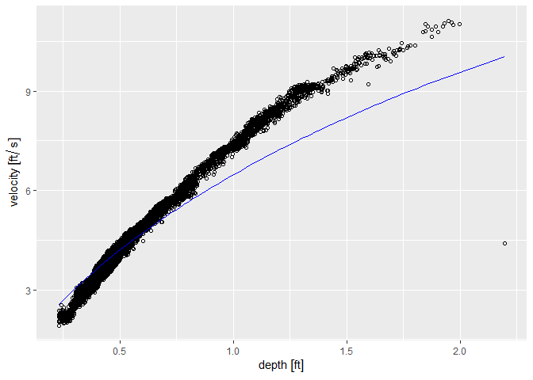
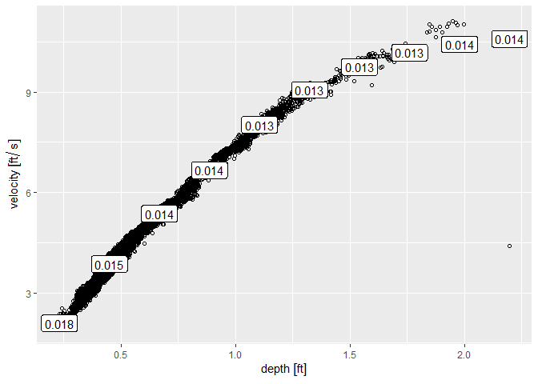
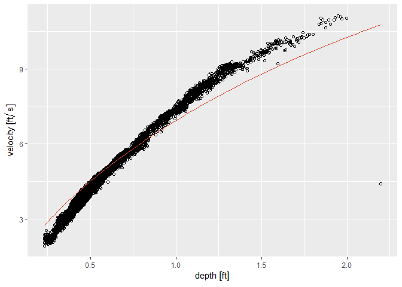

<!-- README.md is generated from README.Rmd. Please edit that file -->

# bes.hydro

<!-- badges: start -->
<!-- badges: end -->

The goal of `bes.hydro` is to provide functionality for open channel
open channel (e.g., a sewer or stormwaterpipe) flow data. Pipe geometry
calculations are included for calculating flow from depth and velocity,
along with functions for calculating velocity and flow using the Manning
equation.

## Installation

You can install the development version of bes.hydro from
[GitHub](https://github.com/) with:

``` r
# install.packages("devtools")
devtools::install_github("jasonelaw/bes.hydro")
```

## Example

Here is an example using included flow data; the depth, velocity, and
flow columns are have had their measurement units set using the
(units)\[<https://r-quantities.github.io/units/index.html>\] package. We
can create a `CircularPipe` object to facilitate pipe calculations and
give it a default roughness coefficient from an included list of
coefficient values. The object can also be used for geometry
calculations:

``` r
library(tidyverse)
#> ── Attaching core tidyverse packages ──────────────────────── tidyverse 2.0.0 ──
#> ✔ dplyr     1.1.4     ✔ readr     2.1.5
#> ✔ forcats   1.0.0     ✔ stringr   1.5.1
#> ✔ ggplot2   3.5.1     ✔ tibble    3.2.1
#> ✔ lubridate 1.9.3     ✔ tidyr     1.3.1
#> ✔ purrr     1.0.2     
#> ── Conflicts ────────────────────────────────────────── tidyverse_conflicts() ──
#> ✖ dplyr::filter() masks stats::filter()
#> ✖ dplyr::lag()    masks stats::lag()
#> ℹ Use the conflicted package (<http://conflicted.r-lib.org/>) to force all conflicts to become errors
```

``` r
library(bes.hydro)
library(units)
#> udunits database from C:/Users/jlaw/AppData/Local/R/win-library/4.4/units/share/udunits/udunits2.xml
```

``` r
data(flow)
print(flow)
#> # A tibble: 17,280 × 10
#>    project_name             location_code location_description manhole_hansen_id
#>    <chr>                    <chr>         <chr>                <fct>            
#>  1 Continuous Collection S… TGD-24        SE 20th & Woodward   ABZ075           
#>  2 Continuous Collection S… TGD-24        SE 20th & Woodward   ABZ075           
#>  3 Continuous Collection S… TGD-24        SE 20th & Woodward   ABZ075           
#>  4 Continuous Collection S… TGD-24        SE 20th & Woodward   ABZ075           
#>  5 Continuous Collection S… TGD-24        SE 20th & Woodward   ABZ075           
#>  6 Continuous Collection S… TGD-24        SE 20th & Woodward   ABZ075           
#>  7 Continuous Collection S… TGD-24        SE 20th & Woodward   ABZ075           
#>  8 Continuous Collection S… TGD-24        SE 20th & Woodward   ABZ075           
#>  9 Continuous Collection S… TGD-24        SE 20th & Woodward   ABZ075           
#> 10 Continuous Collection S… TGD-24        SE 20th & Woodward   ABZ075           
#> # ℹ 17,270 more rows
#> # ℹ 6 more variables: reading_datetime <dttm>, depth [in], velocity [ft/s],
#> #   flow [ft^3/s], depth_qualifier <chr>, velocity_qualifier <chr>
```

``` r
manning_coefficient$`Closed Conduit`$Brickwork$`Lined with cement mortar`
#> [1] 0.012 0.015 0.017
```

``` r
ABZ075 <- CircularPipe$new(
  diameter = 66/12, 
  slope = 0.00826,
  n = manning_coefficient$`Closed Conduit`$Brickwork$`Lined with cement mortar`[2],
  unit = "ft"
)
ABZ075$wetted_area(1.1)
#> [1] 3.38267
```

``` r
ABZ075$wetted_perimeter(1.1)
#> [1] 5.100124
```

We can also plot a depth vs velocity plot and add a Manning curve:



We can see that this curve with the default roughness that we provided
for the pipe doesn’t fit so well for depths over . We can label the best
fit roughness coefficient across the observed depths:

    #> `geom_smooth()` using method = 'gam' and formula = 'y ~ s(x, bs = "cs")'



Based on this, we can adjust the coefficient:

